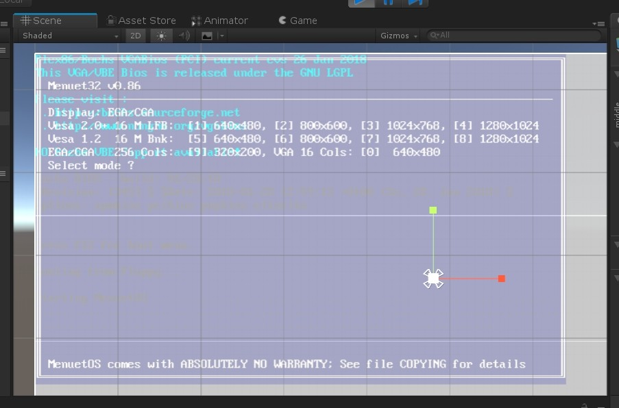

# 基于Unity的X86模拟器
修改自https://github.com/cryogen/VM86CS  
基于Unity 2018.3.0a2版本的项目进行制作。 
原本的意向是希望在PSVita设备上模拟X86内容。 
但是Unity本身的运行效率就很差，因此这个项目更多的是研究学习，而非用于实用。 
此项目极不成熟，还处在最最初始的阶段，因此不推荐用于实用！！  

模拟的CPU非常古老，估计顶多能跑跑DOS或者Win95   

# Unity-based X86 Simulator
Modified from https://github.com/cryogen/VM86CS 
Developed using Unity 2018.3.0a2. 
The original intention was to simulate X86 content on the PSVita device. 
However, Unity itself has poor performance, so this project is more for research and learning purposes rather than practical use. 
This project is highly immature and in its very early stages, so it is not recommended for practical use!!  

The simulated CPU is very outdated and can probably only run DOS or Windows 95 at best.   

# 基于Unity的X86シミュレーター
https://github.com/cryogen/VM86CS を改変したものです。 
Unity 2018.3.0a2をベースにしています。 
元々の目的は、PSVitaデバイスでX86コンテンツをシミュレートすることでした。 
ただし、Unity自体のパフォーマンスが低いため、このプロジェクトは主に研究や学習のために使用されるものであり、実用には適していません。 
このプロジェクトは非常に未熟で、非常に初期の段階にありますので、実用には推奨しません！！  

シミュレートされているCPUは非常に古いため、最大でもDOSやWindows 95を実行する程度と推測されます。   

